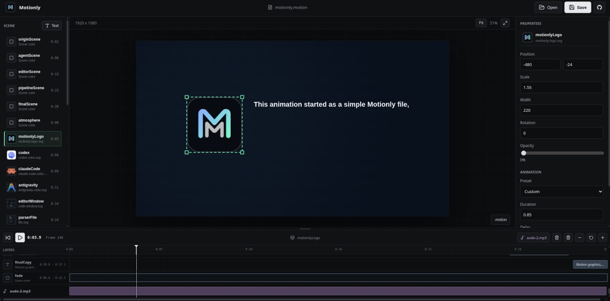

<table width="100%">
  <tr>
    <td align="left" width="120">
      
    </td>
    <td align="right">
      <h1>Motionly</h1>
      <h3 style="margin-top: -10px;">AI-native motion graphics you can still direct.</h3>
    </td>
  </tr>
</table>

<p align="center">
  <em>AI generates an editable project instead of a finished video.<br/>What AI makes is a starting point you can actually direct.</em>
</p>

<p align="center">
  
  
  
  
  <a href="LICENSE"></a>
  <br>
  <a href="https://motionly.mintlify.app/"></a>
  <a href="https://github.com/COPPSARY/Motionly"></a>
</p>

<p align="center">
  <a href="#overview">Overview</a> &middot;
  <a href="#showcase">Showcase</a> &middot;
  <a href="#visual-editor">Visual Editor</a> &middot;
  <a href="#motion-files">Motion Files</a> &middot;
  <a href="#agent-and-llm-support">Agent and LLM Support</a> &middot;
  <a href="#contributing">Contributing</a>
</p>

---

## Showcase

|                     Visual Editor                     |
| :---------------------------------------------------: |
|  |

|                     Animation Preview                      |
| :--------------------------------------------------------: |
|  |

---

## Overview

Motionly is an AI-native motion graphics editor. AI generates an editable project instead of a finished video, then you refine it visually—drag, scale, tune timing, scrub, and export.

Underneath, every project is a plain, readable `.motion` file. What AI makes is a starting point you can actually direct.

The current focus is the core editing loop: reliable preview, direct manipulation, useful animation presets, clear timeline control, clean serialization, and dependable export.

---

## Visual Editor

Current editor features:

**Interface:**
- Left navigation rail with icon-based navigation (Media, Audio, Text, Effects, Scenes, Adjustments, Settings)
- Organized Assets panel with folder structure showing audio and visual assets
- Preset browser with animated GIF previews
- Professional properties panel with custom sliders, styled inputs, and visual preset cards

**Canvas & Preview:**
- Centered canvas preview with the project aspect ratio
- Play, pause, reset, timeline scrubber, timecode, and frame display
- Fit, zoom, and fullscreen preview controls
- Click asset thumbnails for temporary full-screen preview (no timeline disruption)

**Editing:**
- Drag-to-move and corner scaling for elements
- Visual position, scale, rotation, opacity, text, color, timing, and easing controls
- Add text, delete layers, resize the timeline, and trim layer ranges
- Scene, canvas, and timeline selection

**Timeline Clips (New!):**
- Drag and drop media from Assets panel directly onto timeline
- Visual timeline clips with thumbnails
- Create clips at any position with automatic .motion persistence
- Delete clips with one click
- Clips render in preview at correct times

**Audio:**
- Audio defined in `.motion` format (persists with project)
- Synchronized audio preview playback
- Audio shown in organized Assets panel

**Project Management:**
- Open and save `.motion` projects
- Load presets with confirmation dialog
- All edits automatically serialize to `.motion` format

**AI Assistant:**
- BYOK Motionly Assistant that generates and loads editable `.motion` projects
- OpenAI, Anthropic, OpenRouter, Google Gemini, Hugging Face, and custom OpenAI-compatible endpoints
- Locally stored keys and model overrides

**Export:**
- Browser-supported MP4 export with progress

Current limits:

- MP4 export runs in real time and does not include audio from clips yet (see AUDIO_EXPORT_LIMITATION.md)
- Canvas resolution, aspect ratio, and FPS still come from `.motion`
- Clip trimming/repositioning UI is basic (delete and re-add for now)
- WebM, GIF, still-image, and image-sequence export are not exposed yet

---

## Motion Files

The main sample project is:

```text
video-motion/motionly.motion
```

Its sample assets live in:

```text
video-motion/assets/motionly/
```

Example:

```motion
canvas {
  size 1920x1080
  fps 60
  duration 8s
  background #020308
}

camera {
  zoom 1
  x 0
  y 0
}

audio "/assets/my-project/background.mp3"

import "/video-motion/assets/my-project/logo.svg" as mark
import "/video-motion/assets/my-project/video.mp4" as bgVideo

mark {
  center
  layer hero
  width 220
  opacity 0
  animation maskReveal(delay 1s duration 900ms direction down ease power3.out)
}

text title {
  value "Motion graphics, written."
  center
  layer text
  size 72
  textAnimation keynoteText(split words stagger 80ms duration 800ms delay 1s ease power3.out)
}

clip bgVideo {
  track 1
  start 0s
  duration 5s
  trimIn 0s
  trimOut 0s
}
```

Motionly supports semantic layers, camera animation, reusable presets, SVG/image assets, text reveals, generated background effects, timeline clips, audio, preview playback, and MP4 export.

### Use Your Own Assets

For a new animation:

1. Copy `video-motion/motionly.motion` to a new `.motion` file or replace its contents.
2. Remove sample files you do not need from `video-motion/assets/motionly/`.
3. Prefer creating a separate folder such as `video-motion/assets/my-project/`.
4. Add your own images, SVGs, logos, audio files, and videos.
5. Update every `import` path in the `.motion` project.
6. Open the project in Motionly and finish positioning and timing visually.
7. Or drag assets from the Assets panel onto the timeline to create clips.

Images, SVGs, and videos can be imported and used as timeline clips. Audio persists in `.motion` format. Drag assets onto the timeline to create clips that persist in the project file.

**Note:** Timeline clips reference assets by filename. Keep original files in the same location to reload projects with clips.

See [AI Authoring Guide](docs/agents/ai-authoring.mdx) for a complete asset and prompting workflow.

---

## Agent And LLM Support

Motionly includes a built-in AI Chat panel and repository guidance for external agent tools.

Open Motionly Assistant beside Assets, enter your own provider key, and describe the animation you want. Motionly detects OpenAI, Anthropic, OpenRouter, Google Gemini, and Hugging Face keys, or accepts a custom OpenAI-compatible endpoint. You can leave the model blank for Motionly's default or enter an exact model ID. The key and chat history stay in browser storage; requests go directly from the browser to that provider, never through a Motionly server. The assistant receives the current project and imported asset list, returns a `.motion` draft, and exposes a **Load into Editor** action that validates the source through the normal parser and scene-graph pipeline.

**Model quality matters.** The AI model you choose directly affects the quality of generated `.motion` projects. More capable models (like Claude 3.5 Sonnet, GPT-4, or equivalent) produce better composition, timing, and use of animation presets. Smaller or older models may generate valid syntax but produce less polished results. For best results, use a frontier model with strong code generation capabilities.

For agents working inside the repository, use these files:

| Path | Purpose |
|---|---|
| `AGENTS.md` | Product scope and core `.motion` syntax |
| `.agents/skills/write-motionly/SKILL.md` | Storyboard, timing, composition, asset, and validation workflow |
| `.agents/skills/write-motionly/references/motion-syntax.md` | Supported syntax and preset reference |
| `docs/agents/ai-authoring.mdx` | Prompting and project setup guide |

Use this short prompt with an LLM or agent working inside the repository:

```text
Read AGENTS.md and .agents/skills/write-motionly/SKILL.md first.
Inspect my assets, storyboard the animation, then create a valid .motion project.
Use only supported Motionly syntax and presets. Keep one focal subject per shot,
avoid overlap and repeated fade-only scenes, and validate the final project.
Open the result for visual refinement instead of treating the generated file as final.
```

The in-app assistant or external agent creates the first editable version. Motionly remains the place where you preview, adjust, save, and export it.

---

## Goals

Current product goals:

- Make visual editing, selection, timeline trimming, and saving feel reliable.
- Improve preview and MP4 frame pacing on longer projects.
- Add visual canvas controls for FPS, resolution, duration, and aspect ratio.
- Add image, video, and persistent audio clips to the timeline.
- Improve existing animation presets and add a small set of distinct transitions.
- Add more export formats only after MP4 is dependable.
- Provide a hosted editor/sandbox without removing local or self-hosted use.
- Keep BYOK AI drafting optional, local-first, and compatible with external providers.

See the [Roadmap](ROADMAP.md) for the planned order of work.

---

## Architecture

```text
.motion source
  -> parser
  -> AST
  -> scene graph
  -> animation preset compiler
  -> animation evaluator
  -> canvas renderer
  -> preview / export
```

Core folders:

| Path | Purpose |
|---|---|
| `AGENTS.md` | Agent guidance and product boundaries |
| `.agents/skills/write-motionly` | Reusable agent skill for authoring `.motion` |
| `src/ui` | Svelte editor and app shell |
| `src/language` | Tokenizer, parser, AST, and serializer |
| `src/scene` | Scene graph normalization and layer/camera structure |
| `src/animation` | Deterministic animation evaluation |
| `src/animation-library` | Reusable animation presets |
| `src/render` | Canvas renderer |
| `src/export` | MP4 and export pipeline |
| `video-motion` | Sample `.motion` projects and assets |

---

## Open Source

Motionly is licensed under the Apache License 2.0.

Project docs:

- [Introduction](docs/introduction.mdx)
- [Quick Start](docs/quickstart.mdx)
- [Installation](docs/installation.mdx)
- [User Guide](docs/guides/user-guide.mdx)
- [UI Guide](docs/editor/ui-guide.mdx)
- [Motion Language Overview](docs/motion-language/overview.mdx)
- [Animation Presets](docs/animation/presets.mdx)
- [Export Overview](docs/export/overview.mdx)
- [AI Authoring Guide](docs/agents/ai-authoring.mdx)
- [Contributing](CONTRIBUTING.md)
- [Code of Conduct](CODE_OF_CONDUCT.md)
- [Security Policy](SECURITY.md)
- [Roadmap](ROADMAP.md)
- [Changelog](CHANGELOG.md)

---

## Export

Motionly currently exposes MP4 export through the editor when the browser supports MP4 `MediaRecorder` output.

Known limitations:

- Export runs in real time and still needs pacing and reliability improvements.
- Attached audio is not included yet.
- Resolution and FPS use the current canvas settings.
- WebM, GIF, PNG, and image-sequence export are roadmap work.

---

## Run

```bash
npm install
npm run dev
```

Open:

```text
http://localhost:5173
```

---

## Test

```bash
npm test -- --run
npm run build
```

---

## Contributing

Repository:

https://github.com/COPPSARY/Motionly

Contribution priorities:

1. Improve the visual editor and timeline experience.
2. Fix preview and MP4 export performance and correctness.
3. Add focused tests for parser, serialization, presets, editor workflows, and export.
4. Keep `.motion` examples and implementation files readable.
5. Avoid large dependencies unless they clearly simplify the core workflow.

Before opening a PR:

- Run `npm test -- --run`
- Run `npm run build`
- Keep `.motion` examples readable
- Avoid hidden state in rendering
- Do not mutate imported assets
- Prefer deterministic frame evaluation over runtime side effects

---

## Links

<div align="center">

| Platform | Link |
|---|---|
| GitHub | [COPPSARY](https://github.com/COPPSARY) |
| Facebook | [COPPSARY](https://web.facebook.com/profile.php?id=61567582710788) |

</div>

---

<div align="center">
  <p><em>Effortless Animation</em></p>
</div>
